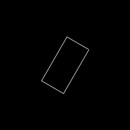
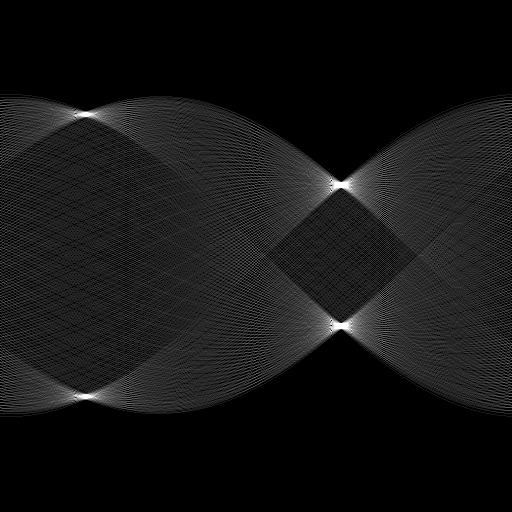
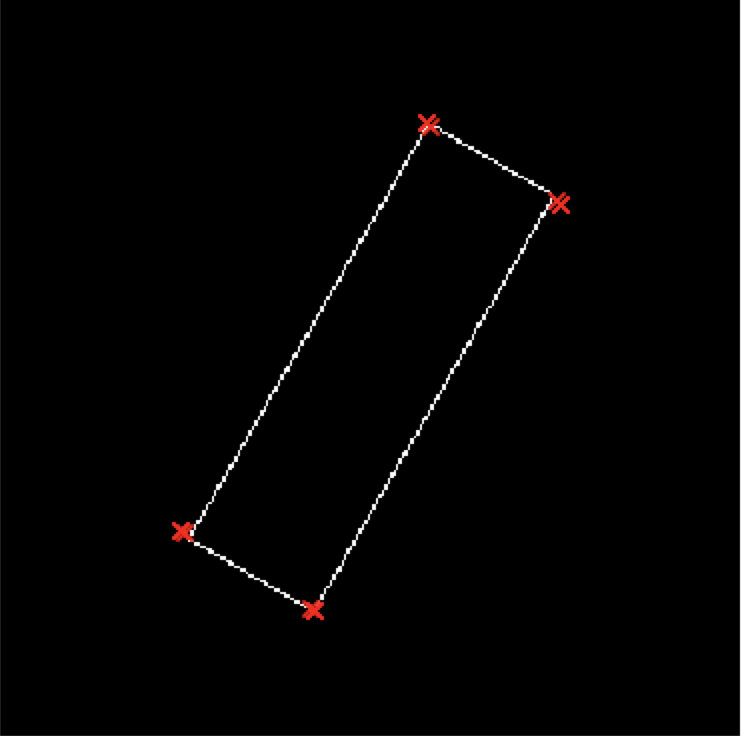

# Hough rectangle detection
## Intro
This is a personal project which aim is to implemenent a rectangle detection algorithm using the Hough transform from the paper ["Rectangle Detection based on a Windowed Hough Transform"](http://citeseerx.ist.psu.edu/viewdoc/download?doi=10.1.1.59.4239&rep=rep1&type=pdf) from C.Jung and R.Schramm.  

The Hough rectangle detection is based on detecting specific patterns in the Hough line transform domain of an image. The algorithm relies on a windowed Hough transform to achieve robustness. 

The implementation is done in c++ and is intended to be lightweight, ie no image processing library is used. We mostly rely on "Eigen" for image manipulation. The algorithm expects edge detection to be performed first. The edge detection is not part of the repo. You can use any library to perform this preprocessing. 

I plan to bring improvements to the original algorithm in order to make it faster. The main cause for slowness is the sliding window scheme. I plan to reuse previous computations in order to reduce redudant ones. More info to come.

The work is currently in progress. Stay tuned!

## Requirements
- cmake >3.11.4
- c++ 14
- Third party libraries are part of the repo: Eigen, catch2, stb, cereal

## Usage
For now, the code only accepts **_png_** images. The input image is expected to be an **_edge detected image_**.  

```
mkdir build 
cd build
cmake ..
make
./apps/main_hough_rectangle -i some_img.png -o output_img.txt
```

The rectangles are saved line by line in the following format: x1,y1,x2,y2,x3,y3,x4,y4

## Algorithm
The Hough rectangle detection algorithm relies on detecting specific patterns in the Hough domain, as illustrated below:

Rectangle            |  Corresponding Hough pattern | Detected rectangle
:-------------------------:|:-------------------------:|:----------------------:
  |    |  


## Project status:
- Hough transform : done
- Enhanced Hough transform : done
- Windowed Hough transform : done
- Peak detection: done
- Hough rectangle detection on rectangle-centric image: done
- Hough rectangle detection on full image: done
- Acceleration: in progress

## Helper scripts
Some python opencv scripts in "utils" folder are provided to facilitate usage. Require _opencv_ and _matplolib_. Call `-h`for help:  
  
-`detect_edges`: applies Canny edge detection algorithm to input.  
-`create_rectangle`: creates some dummy rectangles, with or without an angle.  

## Configuration:
Algorithm parameters can be modified in `src/configs.json`:

1. Hough transform parameters:  

    - theta_bins: number of angle bins
    - rho_bins: number of bins for the normal length
    - theta_min: minimum angle (don't change)
    - theta_max: maximum angle (don't change)

2. Enhanced Hough transform parameters:

    - h: height of neighboorhood used to enhance Hough Transform
    - w: width of neighboorhood used to enhance Hough Transform

3. Windowed Hough transform parameters:

   - L_window: size of the window. Should be bigger than the maximum size of your rectangles
   - r_min: inside radius of the windowed Hough transform
   - r_max: outside radius of the windowed Hough transform

4. Rectangle detection parameters:

   - min\_side\_length: minimum side length of a rectangle
   - T_theta: minimum angle difference (in degrees) between two corners of a rectangle
   - T_rho: minimum normal length difference (in pixel) between two corners of a rectangle
   - T_l:
   - T_alpha: minimum corner difference (in degrees) between opposite corners of a rectangle.
